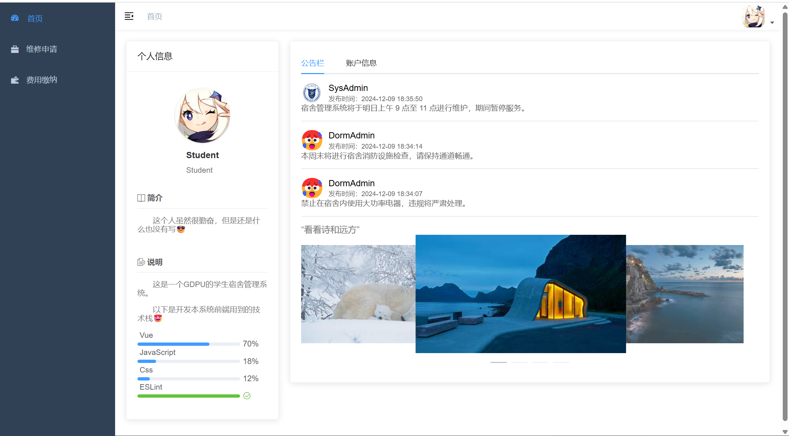
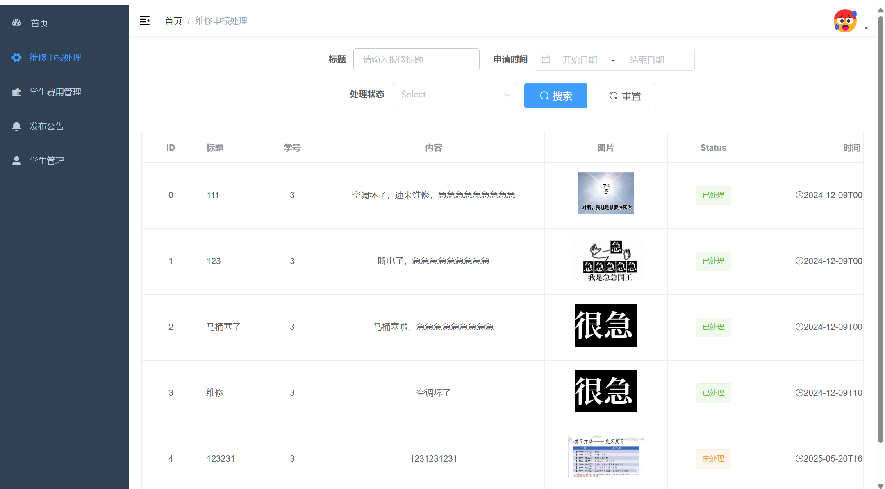
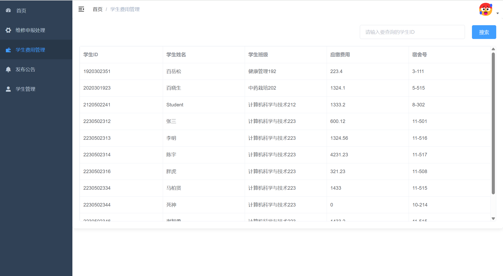
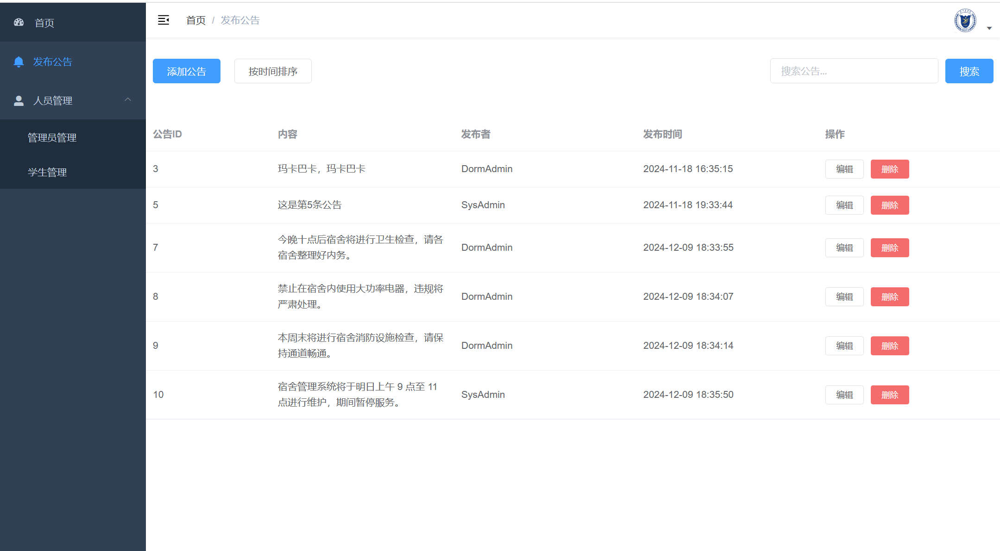

<p align="center">
  
	 <h1 align="center">学生宿舍管理系统 🏠💻</h1>
</p>
<p align="center">


</p>

## 📖 项目简介

## 🚀 项目名称

学生宿舍管理系统

## 🌟 项目背景
随着高校学生宿舍管理需求的日益复杂化，传统的手工管理方式已难以满足高效、便捷的管理需求。为了提升宿舍管理效率，确保信息的准确性和及时性，我们开发了基于Vue.js和SSM框架的学生宿舍管理系统。该系统旨在通过现代化的Web技术，为学生、宿舍管理员和系统管理员提供一个高效、便捷的管理平台。

## 🎉 主要功能

- **权限控制**：系统支持三种用户角色（学生、宿舍管理员、系统管理员），并根据用户角色动态生成路由，实现不同角色访问不同页面的功能。
- **报修管理**：学生可以在线提交宿舍维修申请，管理员可以实时查看并处理这些申请。
- **通知公告**：发布宿舍相关通知和公告，确保信息及时传达。
- **信息查看**：管理员用户可以在主页查看所有个人信息。
- **学生管理**：管理员可以对学生信息进行增删改查操作。
- **管理员管理**：系统管理员可以管理其他管理员账号。
- **费用缴纳**：学生可以查看和缴纳宿舍相关费用。

## 🧰 技术选型

- **前端**：基于 [vue-element-admin](https://panjiachen.github.io/vue-element-admin-site/zh/) 模板进行二次开发。
- **后端**：使用 SSM 框架。
- **数据库**：采用 MySQL 数据库。
- **开发工具**： 前端使用 VSCode，后端使用 IntelliJ IDEA。
- **版本控制**：使用 Git 和 GitHub。

## 📑 目录结构

```shell
backend/
├── pom.xml                            # Maven 项目配置文件
└── src/
    └── main/
        ├── java/edu/GDPU/Demo         # Java 源代码根包
        │   ├── Adminer                # 管理员模块
        │   │   ├── controller           # 控制器类（处理 HTTP 请求）
        │   │   ├── entity               # 实体类（与数据库表映射）
        │   │   ├── mapper               # MyBatis Mapper 接口
        │   │   └── service              # 服务接口及实现
        │   ├── Announcement             # 公告模块
        │   ├── Common                   # 公共模块（如切面、通用 DTO）
        │   │   ├── aspect               # 权限验证切面
        │   │   └── dto                  # 统一返回结果封装类
        │   ├── Student                  # 学生管理模块
        │   └── UserLogin                # 用户登录模块
        └── resources                    # 资源文件目录
            ├── mapper                   # MyBatis 映射文件
            │   ├── AdminMapper.xml
            │   ├── AnnouncementMapper.xml
            │   ├── StudentMapper.xml
            │   └── UserMapper.xml
            ├── applicationContext.xml   # Spring 应用上下文配置
            ├── jdbc.properties          # 数据库连接属性
            ├── log4j.xml                # 日志配置文件
            ├── mybatis-config.xml       # MyBatis 全局配置
            └── spring-mvc.xml           # Spring MVC 配置文件
```
```shell
frontend/               # 前端项目目录，具体开发参考vue-element-admin项目文档
 ├── public/             # 公共资源目录
 │   └── index.html      # 入口 HTML 文件
 ├── src/                # 源代码目录
 │   ├── api/            # API 请求模块
 │   ├── assets/         # 静态资源
 │   ├── components/     # 公共组件
 │   ├── icons/          # 图标资源
 │   ├── layout/         # 布局组件
 │   ├── router/         # 路由配置
 │   ├── store/          # Vuex 状态管理
 │   ├── styles/         # 样式文件
 │   ├── utils/          # 工具函数
 │   ├── views/          # 视图组件
 │   ├── App.vue         # 根组件
 │   └── main.js         # 入口文件
 ├── .env.development    # 开发环境配置
 ├── .env.production     # 生产环境配置
 ├── babel.config.js     # Babel 配置
 ├── package.json        # 项目依赖和脚本
 └── vue.config.js       # Vue CLI 配置

```


## 🖥️ 构建指南

### 环境要求

- Node.js >= 8.9
- npm >= 3.0.0
- Java >= 23
- MySQL >= 8.0
- Tomcat = 9.0

### 开发步骤

1. **克隆项目**

```shell
git clone https://github.com/MaBaiXian/Demo-ssm.git
```

2. **前端开发**

```shell
# 进入前端项目目录
cd frontend

# 安装项目依赖
npm install

# 启动前端项目进行本地开发
npm run dev
```

3. **后端开发**

- 在 IntelliJ IDEA 中连接本地的 MySQL 数据库，并运行 demo.sql 脚本来还原数据库。
- 使用 Maven 安装后端项目所需的依赖。
- 修改本地数据库连接配置，更新数据库密码。

```Java
# backend/src/main/resources/jdbc.properties
# 请将用户名和密码替换为本地数据库的实际用户名和密码
jdbc.url=jdbc:mysql://localhost:3306/demo?allowPublicKeyRetrieval=true&useSSL=false&useUnicode=true&characterEncoding=UTF-8&serverTimezone=Asia/Shanghai
jdbc.username=root
jdbc.password=020218
jdbc.driver=com.mysql.cj.jdbc.Driver
```

- 运行 Tomcat 启动后端服务。(注意，工件输出的上下文路径需要设置为 `/`，否则会导致前端请求路径错误❗❗❗)

## 📺Demo
### 学生端


### 舍管端



### 管理员端
