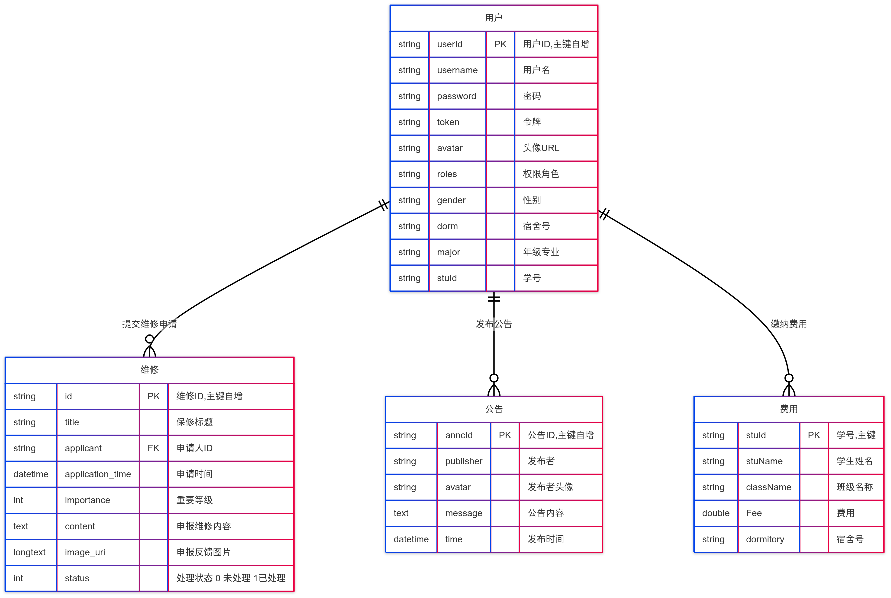
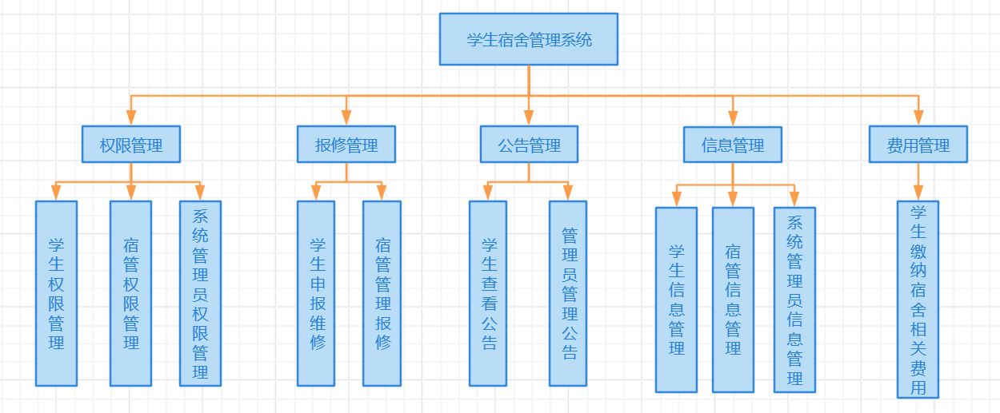

# 项目开发文档

## 项目名称

学生宿舍管理系统

## 1. 案例需求

本项目是一个学生宿舍管理系统，主要功能包括：

### 1.1 权限控制
系统支持三种用户角色：学生、宿舍管理员和系统管理员。根据用户角色动态生成路由，实现不同角色访问不同页面的功能：
- **学生**：可以提交维修申请、查看通知公告、查看个人信息、缴纳费用。
- **宿舍管理员**：可以处理维修申请、发布通知公告、查看和管理学生信息。
- **系统管理员**：可以管理所有管理员账号、查看所有用户信息、管理通知公告等。

### 1.2 报修管理
- **学生**：可以提交宿舍维修申请，填写报修信息。
- **宿舍管理员**：可以查看报修申请，对申请进行处理。

### 1.3 通知公告
- **宿舍管理员和系统管理员**：可以发布、编辑和删除宿舍相关通知和公告。
- **学生**：可以查看通知公告以及公告发布时间。

### 1.4 信息查看
- **管理员**：可以在主页查看所有个人信息，包括账号信息、管理权限等。
- **学生**：可以在主页查看个人信息,通知公告、缴纳费用。

### 1.5 学生管理
- **宿舍管理员和系统管理员**：可以对学生信息进行增删改查操作，包括学生的基本信息。

### 1.6 管理员管理
- **系统管理员**：可以管理其他管理员账号，包括添加、删除、修改管理员权限等。

### 1.7 费用缴纳
- **学生**：可以查看以及缴纳宿舍相关费用。

## 2. 系统分析

### 2.1 开发工具与环境
- **开发平台**：IntelliJ IDEA
- **后端框架**：Spring、SpringMvc、Mybatis
- **JDK版本**：23
- **服务器**：Tomcat 9.0
- **数据库**：MySQL 8.0
- **其他工具**：Git（版本控制）、Postman（接口测试）

### 2.2 项目结构

项目采用MVC架构，整体结构如下：

```shell
Demo-ssm
├── backend/                # 后端项目目录
│   └── src/                # 源代码目录
│       ├── controller/     # 控制器模块，处理HTTP请求
│       ├── dto/            # 数据传输对象（DTO），用于封装处理结果
│       ├── entity/         # 实体类模块，映射数据库表结构
│       ├── mapper/         # MyBatis Mapper接口，用于数据库操作
│       └── service/        # 业务逻辑模块
│           └── serviceimpl/ # 业务逻辑实现类
│
├── frontend/               # 前端项目目录，具体开发参考vue-element-admin项目文档
│   ├── public/             # 公共资源目录
│   │   └── index.html      # 入口 HTML 文件
│   ├── src/                # 源代码目录
│   │   ├── api/            # API 请求模块
│   │   ├── assets/         # 静态资源
│   │   ├── components/     # 公共组件
│   │   ├── icons/          # 图标资源
│   │   ├── layout/         # 布局组件
│   │   ├── router/         # 路由配置
│   │   ├── store/          # Vuex 状态管理
│   │   ├── styles/         # 样式文件
│   │   ├── utils/          # 工具函数
│   │   ├── views/          # 视图组件
│   │   ├── App.vue         # 根组件
│   │   └── main.js         # 入口文件
│   ├── .env.development    # 开发环境配置
│   ├── .env.production     # 生产环境配置
│   ├── babel.config.js     # Babel 配置
│   ├── package.json        # 项目依赖和脚本
│   └── vue.config.js       # Vue CLI 配置
│
├── README.md               # 项目说明文档
└── demo.sql                # SQL脚本文件，用于数据库初始化
```

## 3. 开发过程

### 3.1 数据库设计
#### 数据库设计如下表所示：

### 用户表（user）
| 字段名 | 类型 | 说明 |
|--------|------|------|
| userId | INT | 用户ID，主键自增 |
| username | VARCHAR(100) | 用户名 |
| password | VARCHAR(255) | 密码 |
| token | VARCHAR(255) | 令牌 |
| avatar | VARCHAR(255) | 头像URL |
| roles | VARCHAR(100) | 权限角色 |
| gender | VARCHAR(32) | 性别 |
| dorm | VARCHAR(255) | 宿舍号 |
| major | VARCHAR(255) | 年级专业 |

### 费用表（fee）
| 字段名 | 类型 | 说明 |
|--------|------|------|
| stuId | VARCHAR(10) | 学号，主键 |
| stuName | VARCHAR(10) | 学生姓名 |
| className | VARCHAR(50) | 班级名称 |
| Fee | DOUBLE | 费用 |
| dormitory | VARCHAR(10) | 宿舍号 |

### 维修申请表（repair）
| 字段名 | 类型 | 说明 |
|--------|------|------|
| id | INT | 维修ID，主键自增 |
| title | VARCHAR(255) | 保修标题 |
| applicant | INT | 申请人ID |
| application_time | DATETIME | 申请时间 |
| importance | INT | 重要等级 |
| content | TEXT | 申报维修内容 |
| image_uri | LONGTEXT | 申报反馈图片 |
| status | INT | 处理状态(0未处理/1已处理) |

### 公告表（announcement）
| 字段名 | 类型 | 说明 |
|--------|------|------|
| anncId | INT | 公告ID，主键自增 |
| publisher | VARCHAR(100) | 发布者 |
| avatar | VARCHAR(255) | 发布者头像 |
| message | VARCHAR(1024) | 公告内容 |
| time | DATETIME | 发布时间 |

## 3.2 详细设计

### 3.2.1 维修模块
- **Model（模型）**
  - 实体类：`Repair`、`RepairVO`
  - 数据访问层：`RepairMapper`
- **View（视图）**
  - 前端页面：负责维修申请的增删改查功能
  - Vue 文件：`RepairManagement/index.vue`
- **Controller（控制器）**
  - `RepairController`
- **Service（服务）**
  - 接口：`RepairService`
  - 实现类：`RepairServiceImpl`

### 3.2.2 学生管理模块
- **Model（模型）**
  - 实体类：`Student`
  - 数据访问层：`StudentMapper`
- **View（视图）**
  - 前端页面：负责学生信息的增删改查功能
  - Vue 文件：`StudentManagement/index.vue`
- **Controller（控制器）**
  - `StudentManageController`
- **Service（服务）**
  - 接口：`StudentService`
  - 实现类：`StudentServiceImpl`

### 3.2.3 管理员管理模块
- **Model（模型）**
  - 实体类：`Admin`
  - 数据访问层：`AdminMapper`
- **View（视图）**
  - 前端页面：负责管理员信息的增删改查功能
  - Vue 文件：`AdminManagement/index.vue`
- **Controller（控制器）**
  - `AdminManageController`
- **Service（服务）**
  - 接口：`AdminService`
  - 实现类：`AdminServiceImpl`

### 3.2.4 Fee 模块
- **Model（模型）**
  - 实体类：`Fee`
  - 数据访问层：`FeeMapper`
- **View（视图）**
  - 前端页面：负责费用信息的增删改查功能
    - 学生端页面：`feePayment/components/Feepay.vue`
    - 宿管端页面：`feePayment/showAllFee/index.vue`
- **Controller（控制器）**
  - `FeeController`
- **Service（服务）**
  - 接口：`FeeService`
  - 实现类：`FeeServiceImpl`

### 3.2.5 User 模块
- **Model（模型）**
  - 实体类：`User`
  - 数据访问层：`UserMapper`
- **View（视图）**
  - 前端页面：负责系统登录登出功能
  - Vue 文件：`Login/index.vue`
- **Controller（控制器）**
  - `UserController`
- **Service（服务）**
  - 接口：`UserService`
  - 实现类：`UserServiceImpl`

### 3.2.6 Announcement 模块
- **Model（模型）**
  - 实体类：`Announcement`
  - 数据访问层：`AnnouncementMapper`
- **View（视图）**
  - 前端页面：负责公告信息的增删改查功能
  - Vue 文件：`AnnouncementManagement/index.vue`
- **Controller（控制器）**
  - `AnnouncementController`
- **Service（服务）**
  - 接口：`AnnouncementService`
  - 实现类：`AnnouncementServiceImpl`


## 4. 思考/进一步改进
在完成当前系统的基本功能模块后，我们总结了以下可以进一步改进的方向，以提升系统的整体性能和用户体验：
- **宿舍分配自动化**：开发自动分配宿舍的功能，根据学生的年级、专业和性别等信息，智能分配宿舍，减少管理员的工作量。
- **个性化界面**：允许用户自定义界面主题和布局，提升用户的个性化体验。
- **多语言支持**：随着国际化教育的发展，支持多语言（如英语、日语等）将有助于服务更多国际学生。
- **多因素认证**：增加多因素认证（如短信验证码、邮箱验证码等），提高用户登录的安全性。

## 5. 设计总结

通过本次学生宿舍管理系统的设计与开发，我们收获颇丰。在技术方面，深入学习和实践了 Vue.js、Spring、MyBatis 等前端和后端技术框架，掌握了前后端分离开发模式的流程和协作方式。在团队协作方面，明确了小组成员的分工，学会了如何在团队中有效沟通、协调资源，共同解决遇到的问题。

在开发过程中，我们也遇到了一些困难。例如，前后端数据交互时的数据格式不一致问题，通过仔细调试接口和数据转换逻辑得以解决；在数据库设计方面，对于一些复杂关系的表结构设计（如维修申请表与用户表的关联），经过多次讨论和优化，确保了数据的完整性和一致性。

在解决这些问题的过程中，我们不仅提高了技术能力，还培养了问题解决能力和团队合作精神。对于下一步的工作设想，我们希望进一步完善系统功能，根据用户反馈优化用户体验，同时考虑系统的性能优化和安全性提升，如增加数据缓存机制、对用户密码进行加密存储等，使系统能够更加稳定、高效地运行，满足学生宿舍管理的实际需求。
